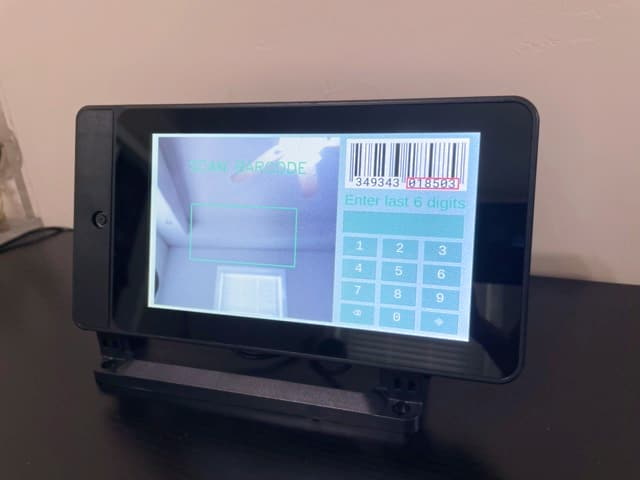

# Python barcode scanner

## Price finding runs on Raspberry Pi and works with Chromis POS (open source)


This software can scan barcodes, search through a MySQL database, and display the search results in text format along with product pictures. The project involved the following technologies:
* Image processing: OpenCV-Python, Pillow
* Barcode reader: pyzbar
* Database connector: mysql-connector
* User interface: PySimpleGUI


## Setup
1. To install the libraries, run these commands inside your terminal: 

  ```bash
pip install PySimpleGUI
pip install opencv-python
pip install pyzbar
pip install mysql-connector
pip install Pillow

   ```
2. Install database. I use [Chromis POS](https://chromis.co.uk/), or you can edit the SQL query to suit your database.
3. I ran this script on a Raspberry Pi 3 with an LCD monitor and a camera for use in my mini store."




## How to use
- Search Price: Scan the barcode or enter the 6-digit product code.
- Exit: enter '666666'
- The screen will turn off automatically when motion is detected, and it will turn back on again

## How to tweak this project
- Optimize performance
- Use laser barcode scanner
